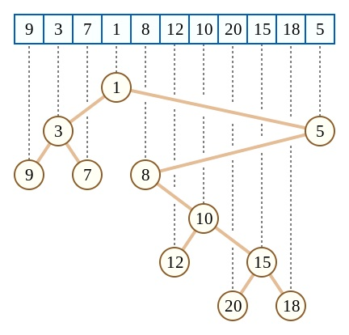

# Heading 1

## Heading 2

### Heading 3

#### Heading 4

##### Heading 5

###### Heading 6

## Emphasis, strong emphasis, and very strong emphasis

An *emphasis*. A **strong emphasis**. A ***very strong emphasis***.

More _emphasis_ test. Even more __strong emphasis__ test. Even more ___very strong emphasis___ test.

Or try **_mixed style very strong emphasis_**. This is an *__alternative__*. This is another _**alternative**_. This is one more __*alternative*__.

## Crossed-out texts

This text is ~~crossed out~~.

## Escape characters, ordered and unordered lists

These are all 10 escape characters reserved by LaTeX:

* \_
* &
* \\
* \~
* ^
* \#
* %
* {
* }
* $

This is an ordered lists containing the same items:

1. \_
2. &
3. \\
4. \~
5. ^
6. \#
7. %
8. {
9. }
10. $

With starting numbering other than 1:

6. \_
2. &
3. \\
4. \~

This is another test:
A paragraph containing HTML escape entity and LaTeX\_escape\_characters: AT&T; &copy; &lt; 3 & 5 = 10 \\ \~

## Inline code and code blocks

This is an `inline code`, printed with typewriter typeset.

This is a `code block` written in C++:

```cpp
#include <iostream>
using namespace std;

int main() {
	int var_with_underscore = 0;
	++var_with_underscore;
	cout << var_with_underscore << endl;
	return 0;
}
```

This is a `plain text` printed in typewriter style:

```text
1 2 3
4 5 6
#include <iostream>
int note_that_the_int_before_should_not_highlight;
```

Or simply omit the `text` format indicator:

```
This is another plain text block
1 2 3
4 5 6
#include <iostream>
int note_that_the_int_before_should_not_highlight;
this line is soooooooooooooooooooooooooooooooooooooooooooooooooooooooooooooooooooooooooooo long that it just cannnnnnnnnnnnnnnnnnnnnnnnnnnnnnnnnnnn't be fitted in a single line, even a single word cannot either
```

## Separators

Below is a horizontal line, half width of the whole page:

***

And you can write something after this.

## Blockquotes

A nested blockquote is as follows:

> This is a blockquote.
>
> > An nested blockquote.
> >
> > Continue the nested blockquote.
>
> The nested blockquote exits.

## Line Breaks and footnotes

This is a line,  
after a line break,[^note]  
to the third line.[^note]

Note that the paragraph above contains two note marks pointing to the same endnote.

This is a new paragraph.

## Links

[alpha](https://example.com "bravo")

<https://example.com>

<https://example.com/a_very_very_very_looooooooooooooooooooooooooooooooooooooooooooooooooooooooooooooooooooooooooooooooong_link>

Here we define and use a link reference: [alpha][example]

[example]: https://example.com

## Images

gif:


svg:


png:


jpg:



## Tables

Normal table:

|  h1   | h2   |   h3 | h4  |
| :---: | :--- | ---: | --- |
|   1   | 2    |    3 | 4   |
|   5   | 6    |    7 | 8   |

Table with different items contained in rows:

|  h1   | h2   |   h3 | h4  |
| :---: | :--- | ---: | --- |
|   1   | 2    |    3 | 4   |
|   5   | 6    |    7 |

Table with no alignment specified and one line containing too many cells:

| h1  | h2  | h3  | h4  |
| --- | --- | --- | --- |
| 1   | 2   | 3   | 4   | 6 |
| 5   | 6   | 7   | 8   |

## Math

This is a math test: $1 + 1 = 2$.

This is a display math:

$$
\sum_{n=1}^{+\infty}\dfrac{1}{n^2}=\dfrac{\pi^2}{6}
$$

## Endnotes

[^note]: a footnote.
